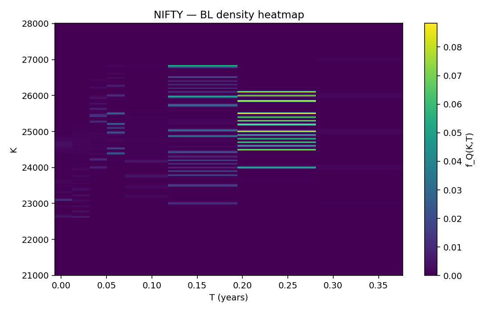
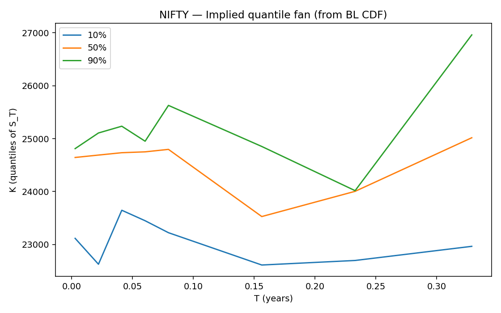

# ⚠️ Work in Progress

This project is under active development. Interfaces and outputs may change. Use at your own risk; this is **not** investment advice.

---

# Breeden–Litzenberger for NSE Options  
**Risk-Neutral Distribution, Range/Breakout Probabilities, and Density Surface (NIFTY & more)**

This repository implements the **Breeden–Litzenberger (BL) approach** on **NSE UDiFF FO option data** to derive **risk-neutral probability distributions** of terminal prices — without using the Black–Scholes model (except for ATM implied volatility estimation).

---

## 📖 Theory: Breeden–Litzenberger (BL)

Breeden–Litzenberger (1978) showed that the **second derivative of the call price curve with respect to strike** equals the **risk-neutral density**:

$$
f_Q(K,T) = \frac{\partial^2 C(K,T)}{\partial K^2}
$$

From this we can derive:

- **Risk-neutral PDF**: distribution of future asset prices.  
- **Risk-neutral CDF**: cumulative probability that $S_T \le K$.

### Key relationships used

1) **Put–Call Parity Regression**

$$
C - P = D\,(F_0 - K)
$$

→ Used to infer **forward price $F_0$** and **discount factor $D$**.

2) **PDF & CDF via BL**

- CDF:

$$
F_Q(K) = 1 + \frac{1}{D}\,\frac{\partial C}{\partial K}
$$

- PDF:

$$
f_Q(K) = \frac{1}{D}\,\frac{\partial^2 C}{\partial K^2}
$$

3) **ATM Implied Volatility**

- Black–Scholes inversion **only at ATM** to size a band:

$$
C_{\text{obs}} \approx C_{\text{BS}}(F_0, K, T, \sigma, D)
$$

- Band defined as:

$$
[L, U] = S_0 \cdot \bigl(1 \pm \sigma_{\text{ATM}}\sqrt{T}\bigr)
$$

---

## 🛠️ Workflow

Each run of the script does:

1. **Download UDiFF FO BhavCopy** for a given date (.zip → fallback .gz).  
2. **Build minimal CE/PE chain** for one symbol (NIFTY/BANKNIFTY/etc.) and the nearest expiry.  
3. **Estimate $F_0$ and $D$** via put–call parity regression.  
4. **Smooth the call-price curve** with a local quadratic fit and compute derivatives → BL CDF/PDF.  
5. **Compute probabilities** of range vs breakout using ATM IV.  
6. **Plot outputs**:
   - Call curve (observed vs smoothed)  
   - BL CDF with band  
   - Multi-expiry density surface  
   - Heatmap  
   - Quantile fan

---

## 📊 Outputs & Interpretation

The script saves graphs in `./images/`. Here’s what they show:

### 1) 3D Density Surface

- X-axis: Strike (terminal price).  
- Y-axis: Time to expiry $T$.  
- Z-axis: Risk-neutral density $f_Q(K,T)$.

**Interpretation**  
- Peaks show where the market concentrates probability.  
- Skewed peaks → asymmetric expectations (e.g., downside risk).

---

### 2) BL CDF with Range Band

- **Curve**: risk-neutral cumulative distribution $F_Q(K)$.  
- **Dashed lines**: lower/upper band $[L, U]$.  
- **Shaded area**: risk-neutral probability of staying in range.

**Interpretation**  
- CDF rises steeply near $S_0$ → market expects low volatility.  
- CDF spreads out → higher implied variance.  
- Range probability $> 55\%$ → prediction = “stay in range”.

---
### 3) Call Curve (Observed vs Smoothed)

- **Scatter**: market-observed call prices.  
- **Line**: smoothed curve used for BL differentiation.  
- **Interpretation**: Smoother → more stable derivatives → more stable PDFs.

---

### 4) Heatmap of Density

- Color intensity = density mass.  
- Useful to see how probability shifts over expiries.

---

### 5) Quantile Fan (10%, 50%, 90%)
**File:** `*_quantile_fan_STARTEXP_to_ENDEXP.png`

- Tracks **risk-neutral quantiles** across expiries.

**Interpretation**  
- Median (50%) ≈ forward path.  
- 10/90% widen with maturity → growing uncertainty.  
- Upward fan skew → implied upside tilt.

---

## 📌 Example Predictions

- **Range (≥ band)**: if $P_{\text{range}} > 0.55$.  
- **Upside breakout**: if $P(S_T > U) > P(S_T < L)$.  
- **Downside breakout**: otherwise.

Example console output:

=== Probabilities (risk-neutral) ===

P_range (L≤S_T≤U): 62%

P_up (S_T>U) : 20%

P_down (S_T<L) : 18%

=== Final model output ===

Predict: RANGE (≥ band), confidence ~62%

---

## 📦 Requirements  

- Python 3.9+  
- `requests`, `pandas`, `numpy`, `matplotlib`  

---

## ⚠️ Disclaimer  

This project is for **research and educational purposes only**.  
It is **not** financial advice.  
